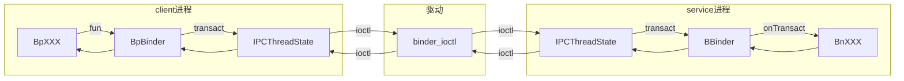
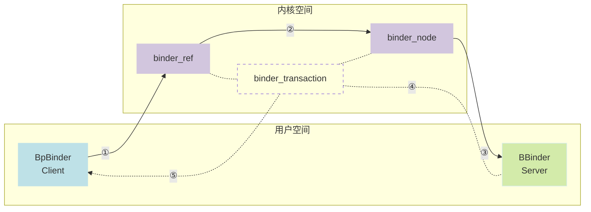

### 调用其他进程方法像调用本地方法一样，一次远程调用流程?

> 注:从cpp层描述

#### 直观感受下远程调用 “hello world”

1. Service进程中，实现aidl定义的接口方法。添加到ServiceManager，开启线程池。代码如下：

```cpp
class HelloBinderImpl : public com::example::BnHelloBinder {
public:
    binder::Status sayHello(const ::android::String16 &content, int32_t *_aidl_return) override {
        printf("%s called, params:%s\n", __FUNCTION__, String8(content).c_str());
        *_aidl_return = 99;
        fflush(stdout);
        return binder::Status::ok();
    }
};

int main() {
    printf("[%d-%d]-binder_hello_service\n", getpid(), gettid());
    sp <IServiceManager> serviceManager = android::defaultServiceManager();

    sp <HelloBinderImpl> helloBinder = sp<HelloBinderImpl>::make();
    status_t status = serviceManager->addService(String16("HelloBinder"), helloBinder);
    if (status != android::OK) {
        printf("add service failed %s\n", statusToString(status).c_str());
        return -1;
    }

    // start the thread pool
    ProcessState::self()->startThreadPool();

    // 主线程延迟退出
    sleep(30);
    return 0;
}
```

2. Client进程获取添加的Service,调用其中的方法。代码如下：

```cpp
int main() {
    printf("[%d-%d]-binder_hello_client\n", getpid(), gettid());
    sp <IServiceManager> serviceManager = android::defaultServiceManager();

    sp <IBinder> helloBinder = serviceManager->checkService(String16("HelloBinder"));
    if (!helloBinder) {
        printf("get service failed null\n");
        return -1;
    }

    sp <com::example::IHelloBinder> helloBinderServer = com::example::IHelloBinder::asInterface(
            helloBinder);

    int ret;
    helloBinderServer->sayHello(String16("hello cpp binder, from client"), &ret);
    printf("call finish, ret:%d\n", ret);
    return 0;
}
```

3. 先启动Service进程，在启动Client进程。可以看到，在Client进程中，只需要通过名字获取到远端的Service，像调用本地方法一样调用远端方法。

Service进程打印

```shell
➜ adb root && adb shell /data/binder_hello_service
adbd is already running as root
[6672-6672]-binder_hello_service
sayHello called, params:hello cpp binder, from client
```

Client进程打印

```shell
adb shell /system/bin/binder_hello_client       
[6680-6680]-binder_hello_client
call finish, ret:99
```

#### 获取ServiceManager

```cpp
// frameworks/native/libs/binder/IServiceManager.cpp
sp<IServiceManager> defaultServiceManager()
{
    std::call_once(gSmOnce, []() {
#if defined(__BIONIC__) && !defined(__ANDROID_VNDK__)
        /* wait for service manager */ {
            using std::literals::chrono_literals::operator""s;
            using android::base::WaitForProperty;
            // servicemanager.ready 在servermanager进程启动后设置成true。frameworks/native/cmds/servicemanager/main.cpp
            while (!WaitForProperty("servicemanager.ready", "true", 1s)) {
                ALOGE("Waited for servicemanager.ready for a second, waiting another...");
            }
        }
#endif

        sp<AidlServiceManager> sm = nullptr;
        while (sm == nullptr) {
            // ProcessState::self()->getContextObject(nullptr) 获取到的其实就是sp<BpBinder> handle是0

            // using AidlServiceManager = android::os::IServiceManager;
            // android::os::IServiceManager::asInterface(ProcessState::self()->getContextObject(nullptr));
            sm = interface_cast<AidlServiceManager>(ProcessState::self()->getContextObject(nullptr));
            if (sm == nullptr) {
                ALOGE("Waiting 1s on context object on %s.", ProcessState::self()->getDriverName().c_str());
                sleep(1);
            }
        }
        // static sp<IServiceManager> gDefaultServiceManager; 静态
        gDefaultServiceManager = sp<ServiceManagerShim>::make(sm);
    });
    return gDefaultServiceManager;
}
```

`call_once`和`gDefaultServiceManager`全局静态变量，只在进程第一次调用时创建。`ProcessState::self()->getContextObject(nullptr)`返回的是`sp<BpBinder>`对象，其handle值为0。`ProcessState::self()`是获取ProcessState对象，ProcessState是进程单例首次调用时创建，在构造函数中初始化驱动相关操作，析构函数中回收。`interface_cast<AidlServiceManager>()`在这里就是`android::os::IServiceManager::asInterface()`，`asInterface()`方法是在aidl生成文件中，通过宏`DECLARE_META_INTERFACE(ServiceManager)`和`DO_NOT_DIRECTLY_USE_ME_IMPLEMENT_META_INTERFACE(ServiceManager, "android.os.IServiceManager")`定义实现的，宏展开后代码如下

```cpp
// IServiceManager.h文件中 定义宏 DECLARE_META_INTERFACE(ServiceManager)
public:
    static const ::android::String16 descriptor;
    static ::android::sp<IServiceManager> asInterface(const ::android::sp<::android::IBinder> &obj);
    virtual const ::android::String16 &getInterfaceDescriptor() const;
    IServiceManager();
    virtual ~IServiceManager();
    static bool setDefaultImpl(::android::sp<IServiceManager> impl);
    static const ::android::sp<IServiceManager> &getDefaultImpl();
private:
    static ::android::sp<IServiceManager> default_impl;
public:
```

在这个宏中定义了，静态的接口描述字符串`descriptor`，获取描述的方法`getInterfaceDescriptor()`。无参构造`IServiceManager()`方法，析构方法`virtual ~IServiceManager()`。`asInterface()`方法将BBinder或者BpBinder对象转成aidl文件中定义的接口指针。静态的默认接口实现变量`static ::android::sp<IServiceManager> default_impl`以及get和set方法。这个默认实现在Service端找不到对应方法，并且也设置了`default_impl`的时候调用。一般情况下Server端和Client端方法应该是一一对应的，除非aidl文件不一致,出现Server端找不到对应方法。

```cpp
// IServiceManager.cpp文件中 实现宏 DO_NOT_DIRECTLY_USE_ME_IMPLEMENT_META_INTERFACE(ServiceManager, "android.os.IServiceManager")
...
::android::sp<IServiceManager> IServiceManager::asInterface(const ::android::sp<::android::IBinder> &obj) {
    ::android::sp<IServiceManager> intr;
    if (obj != nullptr) {
        intr = ::android::sp<IServiceManager>::cast(obj->queryLocalInterface(IServiceManager::descriptor));
        if (intr == nullptr) { intr = ::android::sp<BpServiceManager>::make(obj); }
    }
    return intr;
}
    ...
```

在实现宏中，主要是对上面定义的实现。这里我们主要看`asInterface()`方法是怎么把BBinder或者BpBinder和我们定义的aidl接口关联起来的，[当获取Servcie的进程和实现这个Servcie的进程是同一进程时obj是BBinder](#从servicemanager获取service),更确切的的说obj是`this`指针，也就是添加`addService()`时，我们new出来的要添加的那个Servic指针。Servic的实现是继`::android::BnInterface<IHelloBinder>`,在`BnInterface`类中`queryLocalInterface()`方法返回的是`this`指针。当获取Servcie的进程和实现这个Servcie的进程是不同进程时，obj是BpBinder，此时`queryLocalInterface()`返回nullptr，用obj为参数构造`android::sp<BpServiceManager>`对象，`BpServiceManager::BpServiceManager(const sp<::android::IBinder>& _aidl_impl): BpInterface<IServiceManager>(_aidl_impl)`，所以此时sm的真实类型是`BpServiceManager`，返回时用`sp<ServiceManagerShim>::make(sm)`加了层封装，但最后方法执行还是`BpServiceManager`。

> **注意:**
>
> - `AidlServiceManager`类型是 `android::os::IServiceManager`，`android::os::IServiceManager`是aidl文件生成的类，生成的还有`BpServiceManager.h`,`BnServiceManager.h`,`IServiceManager.cpp`
> aidl文件路径frameworks/native/libs/binder/aidl/android/os/IServiceManager.aidl
> - 这两个宏位于编译后的输出文件`IServiceManager.h`,`IServiceManager.cpp`
> 编译输出目录out/soong/.intermediates/frameworks/native/libs/binder/libbinder/android_recovery_x86_64_silvermont_shared/e560d7b19ebf7276b3e850d3d346dec8/gen/aidl/android/os/

```cpp
sp<IBinder> ProcessState::getContextObject(const sp<IBinder>& /*caller*/)
{
    // sp<BpBinder>
    sp<IBinder> context = getStrongProxyForHandle(0);
    ...
    return context;
}
```

ServiceManager binder对象获取，`getContextObject(null)`内部调用的是`getStrongProxyForHandle(0)`，其实获取普通的Service是也是一样的，只不过handle不在是固定为0。而是是目标Service在当前进程下引用集合的索引，这个值在第一次引用Service时候由驱动生成。驱动中记录了(binder_ref)，每一个进程(binder_proc)引用了哪些Service，这一条条的记录binder_ref，用红黑树把他们联系起来，handle值是这个红黑树的索引。

普通IBinder对象获取，不管是参数传递`sp<IBinder>`，还是返回值返回IBinder对象，都是通过`Parcel::writeStrongBinder(const sp<IBinder>& val)`序列化后向驱动传递，`Parcel::readStrongBinder(sp<IBinder>* val)`反序列化得到IBinder对象。

序列化`Parcel::writeStrongBinder(const sp<IBinder>& val)`最终调用到`flattenBinder(const sp<IBinder>& binder)`在此填充数据，BBinder的`localBinder()`返回`this`指针，BpBinder`localBinder()`返回`nullptr`。`flat_binder_object`是个结构体，用来描述`IBinder`打平之后的对象，在应用层和驱动之前传输。可以看到，序列化`BpBinder`对象时，type是`BINDER_TYPE_HANDLE`，填充了实际handle值。序列化`BBinder`对象时，type是`BINDER_TYPE_BINDER`，cookie是对象的`this`指针,binder是对象的引用计数器`local->getWeakRefs()`。这几个值至关重要。

```cpp
// frameworks/native/libs/binder/Parcel.cpp 
status_t Parcel::flattenBinder(const sp<IBinder>& binder) {
    BBinder* local = nullptr;
    if (binder) local = binder->localBinder(); // this
    if (local) local->setParceled();

    ...
#ifdef BINDER_WITH_KERNEL_IPC
    flat_binder_object obj;
    ...
    if (binder != nullptr) {
        if (!local) {
            // BpBinder
            BpBinder *proxy = binder->remoteBinder();
            ...
            const int32_t handle = proxy ? proxy->getPrivateAccessor().binderHandle() : 0;
            obj.hdr.type = BINDER_TYPE_HANDLE;
            obj.binder = 0; /* Don't pass uninitialized stack data to a remote process */
            obj.flags = 0;
            obj.handle = handle;
            obj.cookie = 0;
        } else {
            // BBinder
            ...
            obj.hdr.type = BINDER_TYPE_BINDER;
            obj.binder = reinterpret_cast<uintptr_t>(local->getWeakRefs());
            obj.cookie = reinterpret_cast<uintptr_t>(local);
        }
    } else {
        obj.hdr.type = BINDER_TYPE_BINDER;
        obj.flags = 0;
        obj.binder = 0;
        obj.cookie = 0;
    }

    obj.flags |= schedBits;

    status_t status = writeObject(obj, false); // binder对象存储位置记录 mObjects[]
    if (status != OK) return status;

    return finishFlattenBinder(binder);
#else  // BINDER_WITH_KERNEL_IPC
    LOG_ALWAYS_FATAL("Binder kernel driver disabled at build time");
    return INVALID_OPERATION;
#endif // BINDER_WITH_KERNEL_IPC
}
```

反序列化`Parcel::readStrongBinder(sp<IBinder>* val)`最终调用到`unflattenBinder(sp<IBinder>* out)`。可以看到，对于`BINDER_TYPE_BINDER`类型也就是BBinder对象，直接把裸指针`flat->cookie`转成`sp<IBinder>`智能指针。对于`BINDER_TYPE_HANDLE`类型也就是BpBinder对象，通过`ProcessState::self()->getStrongProxyForHandle(flat->handle)`创建，和获取ServiceManager是一样的只不过ServiceManager的handle值为0。

```cpp
status_t Parcel::unflattenBinder(sp<IBinder>* out) const
{
    ...
#ifdef BINDER_WITH_KERNEL_IPC
    const flat_binder_object* flat = readObject(false);

    if (flat) {
        switch (flat->hdr.type) {
            case BINDER_TYPE_BINDER: {
                sp<IBinder> binder =
                        sp<IBinder>::fromExisting(reinterpret_cast<IBinder*>(flat->cookie));
                return finishUnflattenBinder(binder, out);
            }
            case BINDER_TYPE_HANDLE: {
                sp<IBinder> binder =
                    ProcessState::self()->getStrongProxyForHandle(flat->handle);
                return finishUnflattenBinder(binder, out);
            }
        }
    }
    return BAD_TYPE;
#else  // BINDER_WITH_KERNEL_IPC
    LOG_ALWAYS_FATAL("Binder kernel driver disabled at build time");
    return INVALID_OPERATION;
#endif // BINDER_WITH_KERNEL_IPC
}
```

> 当我们调用`serviceManager->addService()`把一个Service添加到ServiceManager的时候，驱动就会在ServiceManager进程(binder_proc)中创建binder_ref，表示引用了一个外部Service(binder_node),这样引用多个Service就存在多个binder_ref，这些binder_ref以红黑树形式存储，handle值(desc)是红黑树的索引。 handle是应用层的字段，在驱动中`binder_ref->data.desc`字段。这个值怎么生成的？
>
> - 遍历红黑树找到最小的可用的值
> - 位操作，搜索为0的是第几位，驱动中启用的就是这种方式  `dbitmap_acquire_next_zero_bit`
> - 增加一个字段保存下一次应该使用的desc值不是更快吗？？？
>
> 位操作搜索(硬件指令支持)相较于红黑树的比较，指针操作肯定更快。但红黑树在删除handle后，查找最小可用句柄仍然是可用的，位操作搜索的方式handle值只会增加，删除handle后中间留下空缺。
> handle 0 预留给ServiceManager

#### 一次远程调用

由aidl生成的`BpXXX`中对应的方法触发，比如`BpServiceManager`。执行在目标进程的`BnXXX::onTransact`中进行分发，比如`BnServiceManager`，进而分发到我们的具体实现方法。数据流向如下图：



##### client进程

1. 发起远端调用，数据序列化，写数据到驱动，驱动找到目标进程，目标线程。通知目标线程取数据执行。
2. 从驱动读取数据，还没有数据可以读取时将会睡眠，直到目标线程处理结束后有数据通知。读取数据后填充出参_aidl_reply一步步返回带回结果。

###### 序列化写数据到驱动

```cpp
    // out/.../aidl/android/os/IServiceManager.cpp
    // 输入参数序列化 这里是addService为例
    Parcel _aidl_data;
    _aidl_data.writeUtf8AsUtf16(name);
    _aidl_data.writeStrongBinder(service);
    remote()->transact(code, _aidl_data, &_aidl_reply, 0); // BpBinder

    // frameworks/native/libs/binder/BpBinder.cpp
    // BpBinder中有了handle值，通过这个值找到目标node 进程
    IPCThreadState::self()->transact(binderHandle(), code, data, reply, flags);

    // frameworks/native/libs/binder/IPCThreadState.cpp
    // writeTransactionData(); 数据写入mOut
    binder_transaction_data tr;
    tr.target.handle = handle;
    tr.code = code;
    tr.data_size = data.ipcDataSize(); 
    tr.data.ptr.buffer = data.ipcData();
    // BpBinder BBinder 就是obj，addService的参数service是BBinder对象
    tr.offsets_size = data.ipcObjectsCount()*sizeof(binder_size_t); // byte 
    tr.data.ptr.offsets = data.ipcObjects(); // 数组 每个元素对应obj的地址  
    mOut.writeInt32(BC_TRANSACTION);
    mOut.write(&tr, sizeof(tr));

    // waitForResponse(reply) 写入数据到驱动，从驱动读取数据
    binder_write_read bwr;
    bwr.write_size = mOut.dataSize(); // 不写数据到驱动0
    bwr.write_buffer = (uintptr_t)mOut.data(); 
    bwr.read_size = mIn.dataCapacity(); // 不从驱动读数据0，准备了这么多空间 等驱动填写数据
    bwr.read_buffer = (uintptr_t)mIn.data(); // 不从驱动读数据0
    // sizeof(struct binder_write_read) 48
    ioctl(mProcess->mDriverFD, BINDER_WRITE_READ, &bwr); // 向驱动写入数据 
```

###### 阻塞从驱动读取数据

写数据到驱动后，阻塞等待目标线程执行结束有数据后通知。接收到通知后填充出参Parcel，一步步向上返回到`BpXXX`，反序列化Parcel到具体参数类型，填充出参。

```cpp
    // 向驱动写入数据后，等待驱动填充数据返回。没有数据返回时 阻塞在这里
    ioctl(mProcess->mDriverFD, BINDER_WRITE_READ, &bwr); 

    // waitForResponse()
    // 目标线程执行结束，通知调用线程，醒来组装数据返回
    cmd = (uint32_t)mIn.readInt32();
    switch(cmd){
        case BR_REPLY: {
            binder_transaction_data tr;
            err = mIn.read(&tr, sizeof(tr));
            if (reply) {  // reply出参
                if ((tr.flags & TF_STATUS_CODE) == 0) {
                        // 回复
                        reply->ipcSetDataReference(
                            reinterpret_cast<const uint8_t*>(tr.data.ptr.buffer),
                            tr.data_size,
                            reinterpret_cast<const binder_size_t*>(tr.data.ptr.offsets),
                            tr.offsets_size/sizeof(binder_size_t),
                            freeBuffer);  // freeBuffer是Parcel 析构函数释放时调用
                    } else {
                        // binder线程执行结束，sendReply写结果到驱动时设置TF_STATUS_CODE标志位,
                        // 此时binder线程只关心状态
                        // sendReply的时候waitForResponse(nullptr, nullptr)；逻辑重合？？
                        err = *reinterpret_cast<const status_t*>(tr.data.ptr.buffer);
                        freeBuffer(reinterpret_cast<const uint8_t*>(tr.data.ptr.buffer),
                                   tr.data_size,
                                   reinterpret_cast<const binder_size_t*>(tr.data.ptr.offsets),
                                   tr.offsets_size / sizeof(binder_size_t));
                    }
                } else {
                    // Parcel *reply = null ==> 异步调用  出参reply等于null
                    freeBuffer(reinterpret_cast<const uint8_t*>(tr.data.ptr.buffer), tr.data_size,
                               reinterpret_cast<const binder_size_t*>(tr.data.ptr.offsets),
                               tr.offsets_size / sizeof(binder_size_t));
                    continue;
                }
            }
    }
```

> *BpBinder的handle值怎么确定的？*
> servicemanager handle值固定位0。对于普通service，我们调用`getService(name)`从servicemanager哪里获取时，servicemanager进程通过名字找到对应的Servcie(BpBInder对象)。Parcel::writeStrongBinder(BpBinder)序列化`flat_binder_object obj = {.hdr.type = BINDER_TYPE_HANDLE, .handle = handle, .cookie = 0, .flags = 0, .binder = 0};`注意现在的handle，是要获取的service在servicemanager进程中对应的handle值。把这些数据写入驱动回复调用线程，此时在驱动中通过handle找到要获取的node，确定调用进程target_proc，如果调用进程target_proc中没有对node的引用binder_ref,那么就在target_proc中创建binder_ref，建立起调用进程对node的引用，同时handle值生成。Parcel反序列化时更具type和handle值构建出BpBinder(handle)对象。

##### 驱动

###### write应用层数据到内核

copy应用层数据到内核，解析执行。找到数据要到达的目标进程，唤醒目标线程，让目标线程去处理数据。这里有两种情况

 1. 调用远程方法时，目标进程是service的实现进程。在这里是servicemanager进程，线程没指定。（嵌套调用会指定线程）。
 2. 远程方法执行结束写入结果时，目标线程是远端调用的那个线程。在这里是调用addService方法的那个线程。

```cpp
    // common/drivers/android/binder.c
   
    // binder_thread_write()

    // 1.找到目标进程或线程
    if (reply) {
        // 回复
        // binder_transaction *in_reply_to，当前thread记录着处理的数据, 在被唤醒将要处理数据时赋值
        in_reply_to = thread->transaction_stack;
        // 目标线程，要回复的线程
        target_thread = binder_get_txn_from_and_acq_inner(in_reply_to); // in_reply_to->from
    }else {
        // 调用
        if(tr->target.handle) {
                // handle -> binder_ref -> binder_node handle就是binder_ref的索引
                ref = binder_get_ref_olocked(proc, tr->target.handle, true);
                target_node = binder_get_node_refs_for_txn(ref->node, &target_proc, &return_error);
            } else {
                // service manager 
                // servicemanager进程发送，BINDER_SET_CONTEXT_MGR_EXT时创建node, ptr、cookie都是0;
                target_node = context->binder_context_mgr_node; 
            }
    }

    // struct binder_transaction *t; 描述一次事务的数据结构
    // 作用：组装好的数据后放入目标proc->todo 或者 thread->todo，目标线程取出来执行
    if (!reply && !(tr->flags & TF_ONE_WAY)) // 同步调用
        t->from = thread; 
    else // 回复 或者 异步
        t->from = NULL;
    t->to_proc = target_proc; 
    t->to_thread = target_thread; 
    t->code = tr->code; // tr:应用层传下来的数据 回复时code=0
    t->flags = tr->flags;
    // mmap 映射的共享内存，应用层通过这地址访问数据, 与接收放共享的一块内存
    // is_async 异步 ==> 释放异步buffer时，取noder->async_todo中第一个到proc->todo
    t->buffer = binder_alloc_new_buf(&target_proc->alloc, tr->data_size, tr->offsets_size,.., is_async);
    t->buffer->target_node = target_node; // 回复时 target_node=null

    // 2.copy应用层数据到内核mmap映射区域上的(应用层也可直接访问)。 具体这个内存怎么管理的?? 不知道
    // copy时对obj处理：
    // 2.1 BINDER_TYPE_BINDER(BBinder)：当前进程创建binder_node(如果当前进程还没有的话，根据计数器指针node->ptr判断)，目标进程创建binder_ref
    // 2.2 BINDER_TYPE_HANDLE(BpBinder)：if(当前进程=目标进程) BBinder else 目标进程创建binder_ref(如果目标进程还没有的话，根据node指针ref->node判断)
    // 2.3 BINDER_TYPE_FD(fd)：目标进程新建fd和原进程指向同一个 strut file, 共享偏移量什么的


    // 3.添加work，唤醒目标线程 让目标线程去处理数据
    if (reply){
        // 回复，添加到目标线程 唤醒目标线程
        binder_enqueue_thread_work_ilocked(target_thread, &t->work);
        wake_up_interruptible_sync(&target_thread->wait);
    }else {
        // target_thread嵌套调用时才有值，同步/异步都是null
        binder_proc_transaction(t, target_proc, target_thread); 


        // 同步：从proc->waiting_threads取一个等待的线程
        // 异步：异步执行线程没启动proc->waiting_threads取一个线程，已经启动加到node->async_todo
        // 说明：binder poll线程是取不到了，没有往proc->waiting_threads加，单独通知。poll线程不阻塞 通知有数据才读
        
        // node->has_async_transaction 是否存在异步传输任务
        // pending_async true：异步传输 && node当前存在异步传输work 
        if (!thread && !pending_async && !skip)
           thread = binder_select_thread_ilocked(proc);


        if (thread) {
            // 指定了线程(1.嵌套调用传线程 2.proc->waiting_threads取) 
            binder_enqueue_thread_work_ilocked(thread, &t->work); // thread->todo

        }else if (!pending_async){
             // 同步 && 没指定线程(proc->waiting_threads取不到) ==> poll 或者 没有开启bider线程
             binder_enqueue_work_ilocked(&t->work, &proc->todo); // proc->todo
        }else {
            // 异步 && node->has_async_transaction = true; node存在异步传输任务
            binder_enqueue_work_ilocked(&t->work, &node->async_todo); // node->async_todo
        }    
        if (!pending_async)
        // 同步 || node 还没有异步传输任务，唤醒(poll_wait 或者 binder_wait_for_work线程)
        binder_wakeup_thread_ilocked(proc, thread, !oneway /* sync */);
    }
```

> *binder异步传输线程启动*
>
> 异步任务在唤醒目标线程时，是否存在线程正在执行异步任务，不存在从`proc->waiting_threads`中取一个线程出来执行异步任务，存在则将任务添加到`node->async_todo`。异步任务执行结束，Parcel析构，`binder_free_buf`从`node->async_todo`取一个异步任务加到`proc->todo`准备执行，当`async_todo`空没有异步任务时`node->has_async_transaction = false`。异步任务是一个一个的串行执行(不是同一个线程，但是一次只有一个线程在执行)。同步任务多线程并行执行。

> *binder_ref的创建*
>
> - 向驱动写入BBinder，当前进程创建binder_node，目标进程创建binder_ref。比如`addService(name,service)`,当前进程创建binder_node，`rb_insert_color(&node->rb_node, &proc->nodes);`，servicemanager进程创建binder_ref。
> - 向驱动写入BpBinder，handle -> binder_ref -> binder_node，目标进程创建对binder_node的引用binder_ref，如果目标进程还不存在对应binder_ref的话。比如首次获取某个Service时，`getService(name)`binder线程执行结束，向驱动写入找到的Service(BpBinder)，调用进程创建binder_ref,如果binder_node宿主进程就是目标进程，自己进程给自己进程传BpBinder，此时不创建binder_ref，直接返回Service组件(BBinder)指针。
>
>> - 创建binder_ref时，新建的binder_ref添加到了node->refs，`hlist_add_head(&new_ref->node_entry, &node->refs);`换句话说node中refs链表记录着有哪些引用了这个node。这个值在后续死亡通知，冻结时用到。
>> - 创建binder_ref时，新建的binder_ref添加到了proc->refs_by_node，`rb_insert_color(&new_ref->rb_node_node, &proc->refs_by_node);`和proc->refs_by_desc，`rb_insert_color(&new_ref->rb_node_desc, &proc->refs_by_desc);`，换句话说proc中有两个红黑树保存这个binder_ref，一个以node指针作为索引，一个以desc(u32类型 也就是handle)作为索引。proc->refs_by_node在新建binder_ref前，判断进程中是否已经存在对应bindr_refs时使用。proc->refs_by_desc在远程调用时，通过handle值找到对应binder_ref。

###### read内核数据到应用层

取`proc->todo`或者`thread->todo`中的work出来执行，都没有时阻塞。阻塞的线程在[write添加任务时唤醒](#write应用层数据到内核)。poll方式开启的线程不阻塞，他们只在有数据时才来读。

```cpp
    //binder_thread_read()

    struct binder_transaction_data_secctx tr;
    struct binder_transaction_data *trd = &tr.transaction_data;
    // 这个线程能否执行proc->todo ==> 不是等待回复的线程 && thread->todo空 && binder线(由应用或驱动开启 ProcessState::startThreadPool)
    wait_for_proc_work = binder_available_for_proc_work_ilocked(thread);

    binder_wait_for_work(thread, wait_for_proc_work);

    for (;;) {
        prepare_to_wait(&thread->wait, &wait, TASK_INTERRUPTIBLE|TASK_FREEZABLE); 
        if (binder_has_work_ilocked(thread, do_proc_work))
            break; 
        if (do_proc_work) 
        // 没有要做的work，添加到 proc->waiting_threads。等待回复、binder poll线程没加到proc->waiting_threads它只在有数据可读的时候通知来读
        list_add(&thread->waiting_thread_node, &proc->waiting_threads);
        ...
        // 主动放弃 CPU，让调度器选择其他任务运行。当前线程会进入睡眠状态 (TASK_INTERRUPTIBLE)。
        // binder poll和thread->looper_need_return=true 线程不阻塞
        schedule();
        list_del_init(&thread->waiting_thread_node);
        ...
    }

    // 醒来之后 由那个线程执行分为两种 1.必须由指定线程来完成thread->todo 2.由指定的进程完成(那个线程都行)proc->todo
    if (!binder_worklist_empty_ilocked(&thread->todo))
        list = &thread->todo;
    else if (!binder_worklist_empty_ilocked(&proc->todo) && wait_for_proc_work)
        list = &proc->todo;
    // 取到要执行的work
    w = binder_dequeue_work_head_ilocked(list);    

    // binder_transaction* t; 根据work在binder_transaction的内存布局，从work地址推出binder_transaction地址
    // t 要处理的数据(来自另一进程)。放在proc->todo或者thread->todo这里取出来
    t = container_of(w, struct binder_transaction, work);

    /**组装数据，填充到应用层**/ 
    if (t->buffer->target_node) { 
            // 调用
            struct binder_node *target_node = t->buffer->target_node;
            // 对于servicemanager binder_node来讲，BINDER_SET_CONTEXT_MGR_EXT ptr=0 cookie=0
            trd->target.ptr = target_node->ptr;
            trd->cookie = target_node->cookie;
            ...
            cmd = BR_TRANSACTION;
        } else {
            // 回复
            trd->target.ptr = 0;
            trd->cookie = 0;
            cmd = BR_REPLY;
        }
    trd->code = t->code; 
    trd->flags = t->flags;
    trd->data_size = t->buffer->data_size;
    trd->offsets_size = t->buffer->offsets_size;
    trd->data.ptr.buffer = (uintptr_t)t->buffer->user_data; // 用户空间内核共享内存空间
    trd->data.ptr.offsets = trd->data.ptr.buffer + ALIGN(t->buffer->data_size, sizeof(void *));
    put_user(cmd, (uint32_t __user *)ptr);
    copy_to_user(ptr, &tr, trsize); // 数据到应用层mIn

    if (cmd != BR_REPLY && !(t->flags & TF_ONE_WAY)) {
        // 同步调用
        t->to_parent = thread->transaction_stack;
        t->to_thread = thread;
        // 数据copy到应用层 执行前夕，现场传输栈记录数据。执行结束后，通过这找到要回复的线程 t->from
        thread->transaction_stack = t; 
    }

    /**read完一次数据 驱动请求开启新的binder线程**/
    if ((proc->requested_threads == 0 && // 1: 正在申请创建新的线程 0：没有正在申请创建线程
        list_empty(&thread->proc->waiting_threads) &&  // 没有等待执行任务的线程
        proc->requested_threads_started < proc->max_threads && // 没有超过最大线程数
        // binder looper线程        ProcessState::startThreadPool(); 或者 内核发起创建的线程
        (thread->looper & (BINDER_LOOPER_STATE_REGISTERED | BINDER_LOOPER_STATE_ENTERED))) 
        || force_spawn ) { // 调试
        // ProcessState::self()->startThreadPool() BC_ENTER_LOOPER 的时就已经到这里了
        proc->requested_threads++; // 应用层创建线程结束BC_REGISTER_LOOPER, proc->requested_threads--;
        // 请求应用层创建线程
        put_user(BR_SPAWN_LOOPER, (uint32_t __user *)buffer); 
    }

```

##### service进程

1. binder线程睡眠等待，直到有该线程能处理的数据到来时唤醒
2. 从驱动读取数据，反序列化，执行指令并将结果写会驱动，驱动通知调用线程取结果

实现aidl接口的进程，service进程需要开启线程(binder线程)，用来接收来，处理来自驱动的主动消息。对于client进程开启binder线程不是必须的，如果要接收node死亡通知，需要开启binder线程(客户端来自驱动的主动消息好像只有死亡通知)。

###### 开启binder线程

1. epoll方式，监听binder_fd的EVENT_INPUT事件，事件触发时间接调用到`getAndExecuteCommand()`环获取并执行来自驱动的消息。驱动中线程标志位`BINDER_LOOPER_STATE_ENTERED | BINDER_LOOPER_STATE_POLL`。比如，ServiceManager 就是epoll监听方式的binder线程。

```cpp
    // frameworks/native/cmds/servicemanager/main.cpp
    
    IPCThreadState::self()->setupPolling(&binder_fd);
    // epoll监听binder fd
    looper->addFd(binder_fd, POLL_CALLBACK, EVENT_INPUT, cb, nullptr /*data*/);

    int handleEvent(int /*fd*/ , int /* events */, void* /* data */) override {
        // EVENT_INPUT 事件触发
        IPCThreadState::self()->handlePolledCommands();
        return 1;  // Continue receiving callbacks.
    }

    // frameworks/native/libs/binder/IPCThreadState.cpp
    status_t IPCThreadState::handlePolledCommands(){
        status_t result;
        do {
            result = getAndExecuteCommand();
        } while (mIn.dataPosition() < mIn.dataSize()); // 还有数据可读

        processPendingDerefs();
        flushCommands(); // 刷新mOut
        return result;
    }

```

1. start方式，`ProcessState::startThreadPool()`，开启新线程，在新线程中循环获取并执行来自驱动的消息`getAndExecuteCommand()`。驱动中线程标志位`joinThreadPool(bool isMain)`，isMain为true时 `BINDER_LOOPER_STATE_ENTERED` isMain为false时`BINDER_LOOPER_STATE_REGISTERED`。`ProcessState::startThreadPool()`开启的线程isMain值为true，驱动请求开启的线程isMain值为false。

> - servicemanager进程除了监听binder_fd，还有周期(间隔5s)触发的`timerfd_create`fd，如果设置了`ServiceManager::registerClientCallback(name,service,cb)`周期检查该service是否有引用(是否有client)，引用有无变化时调用`cb`。他是从驱动获取的node引用情况`BINDER_GET_NODE_INFO_FOR_REF`，每5s调用一次，也是大量系统调用。
> - 从应用层看isMain为false的线程是可以退出的，在驱动传回BR_FINISHED时。但是驱动不会传BR_FINISHED到应用层。换句话说驱动开启的binder线程并不会退出。

```cpp
 do {
        ...
        result = getAndExecuteCommand();
        if(result == TIMED_OUT && !isMain) { // BR_FINISHED
            break;
        }
    } while (result != -ECONNREFUSED && result != -EBADF);
    mOut.writeInt32(BC_EXIT_LOOPER);
    mProcess->mCurrentThreads--;   
```

###### binder线程执行，返回结果

```cpp
    // frameworks/native/libs/binder/IPCThreadState.cpp getAndExecuteCommand()
    result = talkWithDriver(/**默认true**/); // 接收来自驱动的消息，ioctl mIn
    cmd = mIn.readInt32(); // cmd包括传输数据 死亡通知 开启线程
    ...
    case BR_TRANSACTION: { // 传输数据
        
    binder_transaction_data_secctx tr_secctx;
    binder_transaction_data& tr = tr_secctx.transaction_data;
    // 指针 长度 handle ptr 来自驱动的数据，sizeof(struct binder_transaction_data) 固定长度64
    // 真正数据 tr.data.ptr.buffer 共享的一块内存空间
    result = mIn.read(&tr, sizeof(tr)); 

    /**binder_transaction_data 到 Parcel**/
    Parcel buffer; 
    buffer.ipcSetDataReference(
    reinterpret_cast<const uint8_t*>(tr.data.ptr.buffer), // 共享内存
    tr.data_size,
    reinterpret_cast<const binder_size_t*>(tr.data.ptr.offsets),
    tr.offsets_size/sizeof(binder_size_t), freeBuffer); // freeBuffer,Parcel析构时触发。也是链接一个个异步调用的触发点
    ...
    // BBinder的transact方法：
    // 1. 默认系统提code
    // PING_TRANSACTION(没有实际数据) 
    // START_RECORDING_TRANSACTION STOP_RECORDING_TRANSACTION (记录发和送接收的数据到文件，二进制协议吗按他的方式来解才能看，文件没存找不到了)

    // 2.不是默认code调用到 BBinder::onTransact->BnInterface::onTransact->BnXXX::onTransact->自己实现
    if (tr.target.ptr) {     
        // 调用service进程中某个方法
        if (reinterpret_cast<RefBase::weakref_type*>(tr.target.ptr)->attemptIncStrong(this)) {
                    // 尝试获取强引用 成功后再调用方法。 tr.cookie转BBinder* 然后调用transact方法
                    error = reinterpret_cast<BBinder*>(tr.cookie)->transact(tr.code, buffer,
                            &reply, tr.flags);
                } else {
                    error = UNKNOWN_TRANSACTION;
                }
    } else {
        // 目标是servicemanager进程。直接调用servicemanager实例的transact方法
        error = the_context_object->transact(tr.code, buffer, &reply, tr.flags);
    }

    if ((tr.flags & TF_ONE_WAY) == 0){ // 同步调用
        constexpr uint32_t kForwardReplyFlags = TF_CLEAR_BUF;
        // 执行结束后，结果reply写会驱动 
        sendReply(reply, (tr.flags & kForwardReplyFlags));
    }

    }
```

#### 死亡通知

正常情况下Service组件被其他Client引用，他是不可能销毁的。但是Service组件宿主进程可能意外崩溃，死亡通知注册回调到驱动，以便Client进程能够在Service组件死亡时获得通知。

##### 注册死亡通知

```cpp
// frameworks/native/libs/binder/BpBinder.cpp
status_t BpBinder::linkToDeath(
    const sp<DeathRecipient>& recipient, void* cookie, uint32_t flags){
    ...
    Obituary ob;
    // struct Obituary { wp<DeathRecipient> recipient; }; 
    ob.recipient = recipient; // 弱引用，外部自己持有好recipient引用
    ob.cookie = cookie;
    ob.flags = flags;
    ...
    if (!mObitsSent) { // 是否已经收到了死亡通知
        if(!mObituaries) {
            mObituaries = new Vector<Obituary>;
            IPCThreadState* self = IPCThreadState::self();
            // 首次注册时 BC_REQUEST_DEATH_NOTIFICATION
            self->requestDeathNotification(binderHandle(), this);
            self->flushCommands(); // 刷新mOut
        }
        ssize_t res = mObituaries->add(ob);
        return res >= (ssize_t)NO_ERROR ? (status_t)NO_ERROR : res;
    }
    return DEAD_OBJECT;
}
```

回调方法放`Vector`，如果是首次注册，给驱动发`BC_REQUEST_DEATH_NOTIFICATION`。

```cpp
    //common/drivers/android/binder.c 
    static int binder_thread_write(){
        switch(cmd){
            case BC_REQUEST_DEATH_NOTIFICATION:{
                ...
                struct binder_ref_death *death = NULL;
                death = kzalloc(sizeof(*death), GFP_KERNEL);
                ref = binder_get_ref_olocked(proc, target, false); // handle -> binder_ref
                death->cookie = cookie; //BpBinder this指针
                ref->death = death; // binder_ref -> death结构体赋值

                if (ref->node->proc == NULL) {
                    // 注册时进程已经退出 ==> 添加work到proc->todo 也是通知了的哈
                    ref->death->work.type = BINDER_WORK_DEAD_BINDER;
                    binder_enqueue_work_ilocked(&ref->death->work, &proc->todo);
                    binder_wakeup_proc_ilocked(proc);
                }
            }
        }
    }
```

驱动收到`BC_REQUEST_DEATH_NOTIFICATION`，创建`binder_ref_death`结构体(包含`BpBinder`指针)，通过`handle`找到`binder_ref`,`binder_ref`的`death`赋值。如果注册死亡通知时`binder_ref`指向`binder_node`宿主进程已经退出，死亡通知的work立即`ref->death->work`添加到`proc->todo`执行，通知应用层。

##### 清除死亡通知

```cpp
    // frameworks/native/libs/binder/BpBinder.cpp
    status_t BpBinder::unlinkToDeath(
    const wp<DeathRecipient>& recipient, void* cookie, uint32_t flags,
    wp<DeathRecipient>* outRecipient){
    ...    
    const size_t N = mObituaries ? mObituaries->size() : 0;
    for (size_t i=0; i<N; i++) {
        const Obituary& obit = mObituaries->itemAt(i);
        if ((obit.recipient == recipient
                    || (recipient == nullptr && obit.cookie == cookie))
                && obit.flags == flags) { // 通过recipient指针 或者 cookie && flage 唯一确定一个回调
            if (outRecipient != nullptr) {
                *outRecipient = mObituaries->itemAt(i).recipient;
            }
            mObituaries->removeAt(i);
            if (mObituaries->size() == 0) {
                // 没有监听的时候 给驱动发送 BC_CLEAR_DEATH_NOTIFICATION
                self->clearDeathNotification(binderHandle(), this);
                self->flushCommands();
                delete mObituaries;
                mObituaries = nullptr;
            }
            return NO_ERROR;
        }
    }
    return NAME_NOT_FOUND;
}
```

回调方法放从`Vector`移除，如果`Vector`中没有回调了，给驱动发`BC_CLEAR_DEATH_NOTIFICATION`。

```cpp
    //common/drivers/android/binder.c 
    static int binder_thread_write(){
        switch(cmd){
            case BC_CLEAR_DEATH_NOTIFICATION:{
                ...
                ref = binder_get_ref_olocked(proc, target, false); // handle -> binder_ref
                death = ref->death;
                ref->death = NULL; //ref->death 置空
                if (list_empty(&death->work.entry)) { // 是否已经被添加到某个链表
                    death->work.type = BINDER_WORK_CLEAR_DEATH_NOTIFICATION;
                    if (thread->looper &(BINDER_LOOPER_STATE_REGISTERED | BINDER_LOOPER_STATE_ENTERED))
                        binder_enqueue_thread_work_ilocked(thread, &death->work);
                    else {
                        binder_enqueue_work_ilocked(&death->work, &proc->todo);
                        binder_wakeup_proc_ilocked(proc);
                    }
                } else {
                    // 已经添加到某个链表，清除死亡通知时node已经死亡，death->work已经添加到了proc->todo 只是还没执行
                    death->work.type = BINDER_WORK_DEAD_BINDER_AND_CLEAR; // 应用层处理完死亡通知后再清除 
                }               
            }
        }
    }
```

驱动收到`BC_CLEAR_DEATH_NOTIFICATION`后，置空`ref->death`。如果`death->work`已经添加打某个链表，说明此时死亡通知已经触发，添加到了`proc->todo`，只是还没执行。`work.type = BINDER_WORK_DEAD_BINDER_AND_CLEAR`，表示在应用层执行后，清除死亡通知。否则`death->work.type = BINDER_WORK_CLEAR_DEATH_NOTIFICATION`，表示回收`ref->death`资源。

##### 触发死亡通知

binder进程退出，`ProcessState::~ProcessState()`析构函数中关闭binder fd时`close(mDriverFD)`，触发驱动`binder_flush`，`binder_release`方法。异步排队由内核线程执行`static DECLARE_WORK(binder_deferred_work, binder_deferred_func)`。遍历该进程下所有`proc->nodes`，找到每个node被那些`binder_ref`所引用，每个`binder_ref`如果有注册死亡通知，则加到proc->todo执行通知应用层。

```cpp
    // binder_deferred_release 遍历释放node
    while ((n = rb_first(&proc->nodes))) {
        // node
        struct binder_node *node;
        node = rb_entry(n, struct binder_node, rb_node);
        ...
        rb_erase(&node->rb_node, &proc->nodes);
        incoming_refs = binder_node_release(node, incoming_refs);
    }

    // binder_node_release
    if (hlist_empty(&node->refs) && node->tmp_refs == 1) {
        ...
        // 没有被引用才会释放node。有其他binder_ref 指向该node的话 是没有回收的
        binder_free_node(node); 
        return refs;
    }

    // 遍历所有引用该node的 binder_ref, 有死亡通知则触发
    hlist_for_each_entry(ref, &node->refs, node_entry) {
        ...
        if (!ref->death) {
            continue;
        }
        // ref->death->work 添加到ref->proc->todo 并唤醒 ==> 触发死亡通知
        ref->death->work.type = BINDER_WORK_DEAD_BINDER;
        binder_enqueue_work_ilocked(&ref->death->work, &ref->proc->todo);
        binder_wakeup_proc_ilocked(ref->proc);
    }
```

> `ProcessState`静态变量`static sp<ProcessState> gProcess;`，生命周期和进程生命周期一致，所以进程退出时`ProcessState`的生命周期才会结束，析构函数才会触发

##### 接收死亡通知

驱动处理`BINDER_WORK_DEAD_BINDER`和`BINDER_WORK_DEAD_BINDER_AND_CLEAR`类型work，将`cookie`(BpBinder指针)和指令`BR_DEAD_BINDER`传入应用层。应用层接收来自驱动的通知`BR_DEAD_BINDER`，触发`cookie`(BpBinder)注册的死亡回调方法。

```cpp
    //common/drivers/android/binder.c  
    // binder_thread_read()
    if (w->type == BINDER_WORK_CLEAR_DEATH_NOTIFICATION)
        cmd = BR_CLEAR_DEATH_NOTIFICATION_DONE; 
    else
        cmd = BR_DEAD_BINDER; 
    cookie = death->cookie;
    if (w->type == BINDER_WORK_CLEAR_DEATH_NOTIFICATION) {
        ...
        kfree(death);
    } else {
        // BINDER_WORK_DEAD_BINDER_AND_CLEAR 或 BINDER_WORK_DEAD_BINDER
        ...          
        // 死亡通知 通知到应用层时 w保存到了delivered_death，在收到应用层处理结束后
        // 查看是否是 BINDER_WORK_DEAD_BINDER_AND_CLEAR 类型，如果是清除死亡通知  
        binder_enqueue_work_ilocked(w, &proc->delivered_death);        
    }

    // 通知应用层
    put_user(cmd, (uint32_t __user *)ptr);
    put_user(cookie, (binder_uintptr_t __user *)ptr);
```

驱动中收到死亡通知时，将work保存到`proc->delivered_death`后，再通知到的应用层。在应用层执行完死亡通知后，发送`BC_DEAD_BINDER_DONE`到驱动时，驱动从`proc->delivered_death`中取work出来，如果是`BINDER_WORK_DEAD_BINDER_AND_CLEAR`类型执行清除操作。对应死亡通知已经触发还未执行时，收到了取消死亡通知的情况，先发送死亡通知到应用，处理之后再清除死亡通知。

```cpp
    // frameworks/native/libs/binder/IPCThreadState.cpp
    BpBinder *proxy = (BpBinder*)mIn.readPointer(); // BpBinder指针
    proxy->sendObituary();
    mOut.writeInt32(BC_DEAD_BINDER_DONE); // 
    mOut.writePointer((uintptr_t)proxy);

    // frameworks/native/libs/binder/BpBinder.cpp
    // sendObituary()
    Vector<Obituary>* obits = mObituaries;
    mObitsSent = 1;

    if (obits != nullptr) {
        const size_t N = obits->size();
        for (size_t i=0; i<N; i++) {
            reportOneDeath(obits->itemAt(i));
        }
        delete obits; // 执行之后删，
    }

    // reportOneDeath()
    sp<DeathRecipient> recipient = obit.recipient.promote(); // obit.recipient 弱引用 升强引用
    if (recipient == nullptr) return;
    recipient->binderDied(wp<BpBinder>::fromExisting(this));
```

应用层收到来自驱动的死亡通知`BR_DEAD_BINDER`，执行`BpBinder::sendObituary()`把`Vector`中的每个回调拿出来执行。需要注意`wp<DeathRecipient>`保存的是回调的弱引用，意味着外部保存好`sp<DeathRecipient>`的引用，如果回调对象不存在了，也就不能触发了。

#### ~~冻结(binder冻结)~~

`IPCThreadState::freeze`方法冻结或者解冻一个binder进程。
当被冻结的进程为目标进程时，在work添加到todo的时候会进行判断，如果是同步直接返回`BR_FROZEN_REPLY`，应用层收到后返回到方法是`FAILED_TRANSACTION`。向被冻结进程的todo，添加同步传输任务，失败`FAILED_TRANSACTION`。

> - 有点历史遗迹的意思，驱动和应用层上对不上
> - 被冻结了异步binder传输依然可以

```cpp
    // frameworks/native/libs/binder/IPCThreadState.cpp
    status_t IPCThreadState::freeze(pid_t pid, bool enable, uint32_t timeout_ms){
        struct binder_freeze_info info;

        info.pid = pid;
        info.enable = enable;
        info.timeout_ms = timeout_ms;
        ...
        ioctl(self()->mProcess->mDriverFD, BINDER_FREEZE, &info)
    }

    // binder.c binder_proc_transaction
    // 在work添加到todo前
    // 进程冻结 && 同步 ==> BR_FROZEN_REPLY
    // 进程或线程退出 ==> BR_DEAD_REPLY
    if ((proc->is_frozen && !oneway) || proc->is_dead || (thread && thread->is_dead)) {
        ...
        return proc->is_frozen ? BR_FROZEN_REPLY : BR_DEAD_REPLY;
    }
```

#### 引用变化



1. Client进程中的BpBinder，向Server进程中的BnBinder发起通信请求，Binder驱动根据传过来的handle找到到binder_ref。(`struct binder_ref { struct binder_ref_data data }; struct binder_ref_data { uint32_t desc; };`)。

2. binder_ref找到对应的binder_node(`struct binder_ref{ struct binder_node *node; }`binder_ref内部持有node指针)，并且创建一个事务(`binder_transaction`)，描述此次通信过程。

3. binder_node找到对应的BBinder对象(`struct binder_node{ binder_uintptr_t ptr;binder_uintptr_t cookie; };`binder_node内部持有BBinder对象指针cookie)，Server端执行线程传输栈，记录下当前事务(`thread->transaction_stack = t`)，并将Client传过来的数据交给BBinder对象处理。

4. BBinder对象处理完来自Client请求后。将结返回Binder驱动，根据3中记录的线程传输栈，找到创建的事务。

5. 根据事务属性找到发起请求的Client线程(`struct binder_transaction { struct binder_thread *from }`)，通知该线程，将结果返回到BpBinder。

> `binder_transaction`内核中，调用线程(Client)和执行线程(Server)间传递数据
> 用户空间，内核空间传递数据的结构体是`binder_transaction_data`。

##### BBinde

用户空间创建，运行在Server进程中。BBinder对象一方面被运行在Server进程中其他对象所引用，另一方面被Binder驱动中binder_node所引用。BBinder继承RefBase，Server进程中其他对象通过智能指针来引用BBinder对象，控制他们生命周期。binder_node运行在内核空间，不能通过智能指针引用用户空间的BBinder对象。因此Binder驱动和Server进程就约定了一套规则来维护他们的引用计数，避免BBinder对象在被b引用的情况下销毁。

> - 应用层BBinder的生命周期，受内核中binder_node生命周期影响，虽然没有出现赋值(`=`)操作，我们也说binder_node引用了BBinder。
> - 一个对象的唯一标识给了谁，我们就说谁引用了对象。比如，BBinder的指针给到了binder_node，binder_node引用了BBinder。binder_ref的句柄(desc/handle)给到了BpBinder，BpBinder引用了binder_ref。在引用存在的情况下，对象肯定不能销毁。

##### binder_node

驱动程序中创建，与服务端的BBinder对象一一对应，一个BBinder在内核中最多只会有一个binder_node，他是根据BBinder的应用计数器地址(`node->ptr`)来判断存不存在的。被binder_ref所引用。当一个BBinder对象第一次被跨进程传递时，Binder驱动会为它创建一个binder_node，并记录下这个node对应的用户空间地址cookie和引用计数器地址ptr。

```cpp
    // servicemanager: flat_binder_object obj {.flags = FLAT_BINDER_FLAG_TXN_SECURITY_CTX,};
    // seivice: flat_binder_object obj { // local是BBinder*
    //         .hdr.type = BINDER_TYPE_BINDER,
    //         .binder = reinterpret_cast<uintptr_t>(local->getWeakRefs()),
    //         .cookie = reinterpret_cast<uintptr_t>(local),
    // };

    // binder_init_node_ilocked()
    binder_uintptr_t ptr = fp ? fp->binder : 0;
    binder_uintptr_t cookie = fp ? fp->cookie : 0;

    node->ptr = ptr; // BBinder应用空间引用计数器指针
    node->cookie = cookie; // BBinder应用空间指针
```

##### binder_ref

驱动程序中创建，与客户端的BpBinder对象一一对应，一个BpBinder内部的句柄(handle)就对应着内核里的一个binder_ref，他是根据binder_ref中node地址(`ref->node`)来判断存不存在的。当一个客户端进程第一次获取到某个服务的代理时，驱动会为这个客户端进程创binder_ref，并让它指向目标服务的binder_node。同时，驱动会返回一个整数句柄(handle)给客户端，客户端用这个handle来创建BpBinder。

```cpp
    struct binder_ref {
        struct binder_node *node; // 指向所引用的node
    };
```

> 一个进程可能即时客户端进程又是服务端进程。比如，从ServiceManager获取Service时，调用进程作为客户端，获取服务代理对象(BpBinder)驱动为调用进程创建binder_ref。向ServiceManager添加Service时，调用进程成了服务端，servicemanager进程作为客户端获取服务代理对象(BpBinder)，驱动为servicemanager进程创建binder_ref。

##### BpBinder

用户空间创建，运行在Client进程中。它是服务端对象在客户端进程中的一个远程引用。BpBinder对象一方面被运行在Client进程中的其他对象所引用，另一方面它也引用Binder驱动中的binder_ref对象。因此Binder驱动和Client进程就约定了一套规则来维护他们的引用计数，避免binder_ref在还被引用的情况下销毁。

> 每一个Service组件在驱动中都对应有一个binder_node，用来描述Service组件在内核中的状态。驱动中通过强引用，弱引用计数来维护binder_node的生命周期。当一个binder_node的引用计数由0变成1，或者有1变成0时，驱动会请求对应Service组件增加或者减少引用计数。

```cpp
    // binder.c  binder_inc_node_nilocked() node强引用增加
    // node->work添加到todo
    node->internal_strong_refs++;
    if (!node->has_strong_ref && target_list) {
        // has_strong_ref：是否已经通知用户空间 强引用增加
        struct binder_thread *thread = container_of(target_list, struct binder_thread, todo);
        ...
        // node->work.type = BINDER_WORK_NODE
        binder_enqueue_deferred_thread_work_ilocked(thread, &node->work);  // deferred延时没有设置 process_todo 
    }

    strong = node->internal_strong_refs || node->local_strong_refs;
    if (strong && !has_strong_ref) {
        node->has_strong_ref = 1;
        ...
    }
    if (!ret && strong && !has_strong_ref)
        // 由于有远端引用，宿主进程BBinder +1。
        // 只在远端进程第一次引用时 +, 多次引用 只要保证最少有一个对应用层引用即可，减少和应用层交互
        ret = binder_put_node_cmd(proc, thread, &ptr, node_ptr, node_cookie, node_debug_id, BR_ACQUIRE, "BR_ACQUIRE");

    // IPCThreadState::executeCommand 应用层收到BR_ACQUIRE后 强引用+1 
    refs = (RefBase::weakref_type*)mIn.readPointer();
    obj = (BBinder*)mIn.readPointer();
    obj->incStrong(mProcess.get());
```

#### binder驱动内核快照

##### 查看进程binder状态

- 挂载目录

```shell
    adb shell "mount -t debugfs none /sys/kernel/debug" // debugfs 内核虚拟文件
```

- 查看进程binder状态

```shell
➜ adb shell cat /sys/kernel/debug/binder/proc/203   //203 servicemanager进程
binder proc state:
proc 203                                //1
context binder                          //2
  thread 203: l 22 need_return 0 tr 0   //3
  node 1: u0000000000000000 c0000000000000000 pri 0:120 hs 1 hw 1 ls 1 lw 1 is 92 iw 92 tr 1    //4
  proc 3974 3913 3849 3812 ...          //5
  ref 8: desc 1 node 7 s 1 w 1 d 0000000000000000 //6
```

各字段意义

```cpp
    //1. proc 203
    seq_printf(m, "proc %d\n", proc->pid); 

    //2. context binder/hwbinder
    seq_printf(m, "context %s\n", proc->context->name); 

    //3. thread 203: l 22 need_return 0 tr 0
    seq_printf(m, "  thread %d: l %02x need_return %d tr %d\n", 
    thread->pid, thread->looper, 
    thread->looper_need_return, 
    atomic_read(&thread->tmp_ref));

    //4. pri 0:120 hs 1 hw 1 ls 1 lw 1 is 92 iw 92 tr 1
    hlist_for_each_entry(ref, &node->refs, node_entry)
        count++; // node被引用数
    seq_printf(m, "  node %d: u%016llx c%016llx pri %d:%d hs %d hw %d ls %d lw %d is %d iw %d tr %d",
           node->debug_id, (u64)node->ptr, (u64)node->cookie,
           node->sched_policy, node->min_priority,
           node->has_strong_ref, node->has_weak_ref,
           node->local_strong_refs, node->local_weak_refs,
           node->internal_strong_refs, count, node->tmp_refs); //iw, node被引用数

    //5. proc 3974 3913 3849 3812 3776 3709 3578 ... 
    if (count) {
        seq_puts(m, " proc");
        hlist_for_each_entry(ref, &node->refs, node_entry)
            seq_printf(m, " %d", ref->proc->pid); // 被哪些进程所引用，进程id
    }

    //6. ref 8: desc 1 node 7 s 1 w 1 d 0000000000000000
    seq_printf(m, "  ref %d: desc %d %snode %d s %d w %d d %pK\n",
    ref->data.debug_id, ref->data.desc,
    ref->node->proc ? "" : "dead ",
    ref->node->debug_id, ref->data.strong,
    ref->data.weak, ref->death);
```

##### addService操作带来的引用变化

```cpp
    sp <IServiceManager> serviceManager = android::defaultServiceManager();
    sp <HelloBinderImpl> helloBinder = sp<HelloBinderImpl>::make();
    status_t status = serviceManager->addService(String16("HelloBinder"), helloBinder);
    ProcessState::self()->startThreadPool();
```

```shell
➜ adb shell cat /sys/kernel/debug/binder/proc/203
binder proc state:
proc 203
context binder
    thread 203: l 22 need_return 0 tr 0
    node 1: u0000000000000000 c0000000000000000 pri 0:120 hs 1 hw 1 ls 1 lw 1 is 92 iw 92 tr 1 proc 4220 4151
    ref 8: desc 1 node 7 s 1 w 1 d 0000000000000000
```

- 添加前servicemanager进程binder状态，从上面可以看出，

1. 主线程(线程id和进程id相同203)， epoll方式的binder线程(22)。
2. binder_node的debug_id是1，ptr和cookie为0，有92个binder_ref指向该node，这些binder_ref来自进程4220 4151...。  
3. binder_ref的debug_id是8,desc(handle)值为1，其指向的是debug_id为7的node。

- 添加后servicemanager进程binder状态，

```shell
adb shell cat /sys/kernel/debug/binder/proc/203
binder proc state:
proc 203
context binder
    thread 203: l 22 need_return 0 tr 0
    node 1: u0000000000000000 c0000000000000000 pri 0:120 hs 1 hw 1 ls 1 lw 1 is 93 iw 93 tr 1 proc 5435 4220 
    ref 8: desc 1 node 7 s 1 w 1 d 0000000000000000
    ref 241054: desc 307 node 241053 s 1 w 1 d 0000000000000000
```

对比发现，增加来自5435进程的binder_ref指向该bidner_node。新增binder_ref desc为307指向debug_id为241053的node。

- 添加进程binder状态，

```shell
➜ adb shell cat /sys/kernel/debug/binder/proc/5435   
binder proc state:
proc 5435
context binder
  thread 5435: l 00 need_return 0 tr 0 // 发起远程方法调用的线程
  thread 5437: l 12 need_return 0 tr 0
  thread 5438: l 11 need_return 0 tr 0
  node 241053: u00007719b6b51b50 c0000771af6b5bb98 pri 0:139 hs 1 hw 1 ls 0 lw 0 is 1 iw 1 tr 1 proc 203
  ref 241051: desc 0 node 1 s 1 w 1 d 0000000000000000
```

binder_node的debug_id是241053，被来自进程203的binder_ref所引用。同时它也存在debug_id为241051的binder_ref指向debug_id为1的node。

内核版本：
https://android.googlesource.com/kernel/common 
android14-6.1-2024-10_r25

aops版本：https://mirrors.tuna.tsinghua.edu.cn/git/AOSP/platform/manifest
android-14.0.0_r30

> aosp 代码镜像地址 `repo init -u https://mirrors.tuna.tsinghua.edu.cn/git/AOSP/platform/manifest -b  android-14.0.0_r30`

Build number：aosp_cf_x86_64_phone-userdebug 14 AP1A.240405.002 eng.tys.20251016.021920 test-keys

#### binder java接口
